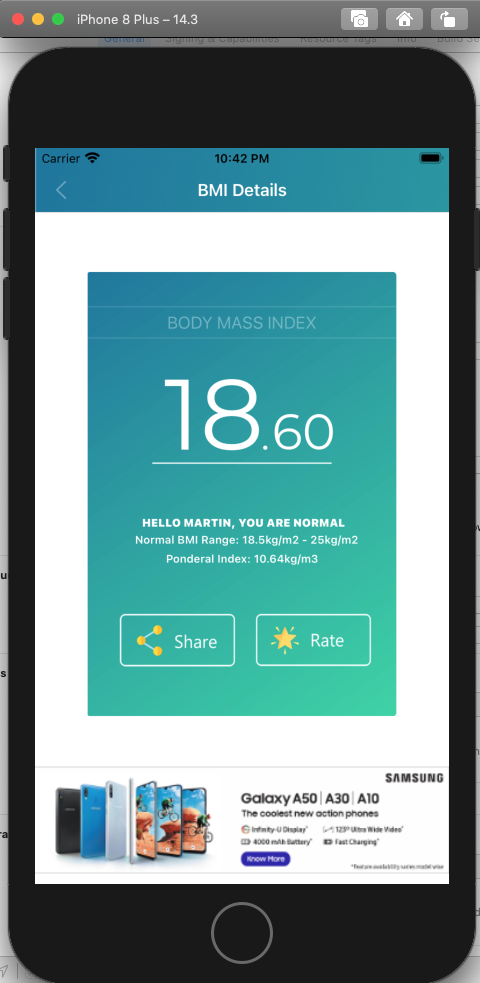

# Result

## Improvements

Please notice that the UI only works properly in this project, with the iPhone 8 plus only. If we changed the markup so that the background would fill the whole space and not just some, as it is required to make a clone of the Markup for this simple UI. Then this background would be able to fill out all the empty space and thereby, letting it become independent of the other components. In this case it should be possible to complete the constraints, so it will be working on all devices.
